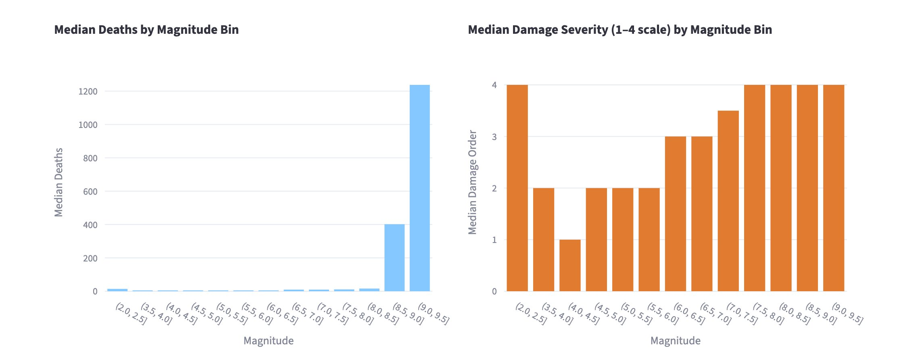
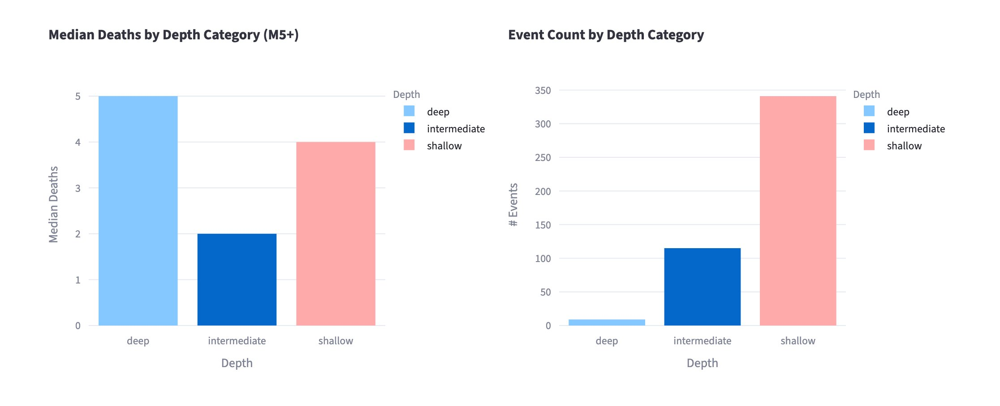
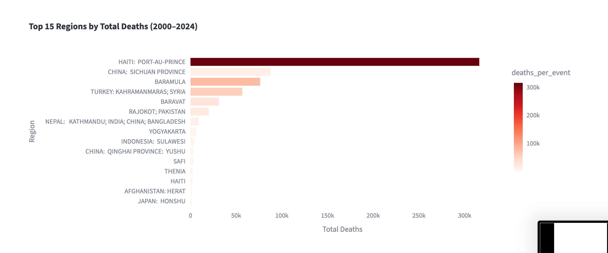
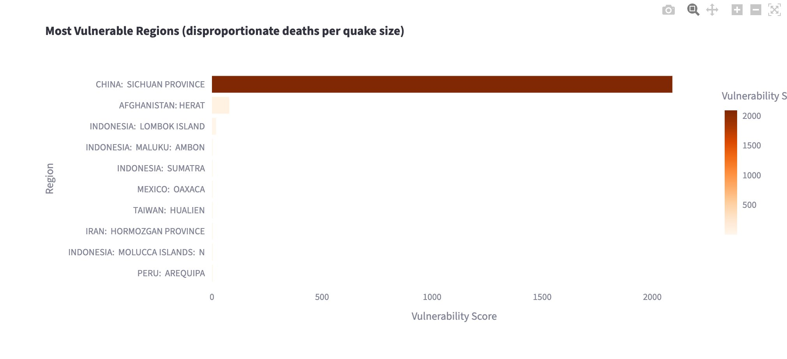
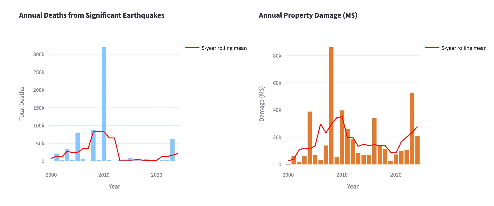

## Introduction

Earthquakes are commonly characterized by physical properties such as
magnitude and depth, yet these measures alone do not fully capture their
real-world impact. Two earthquakes of similar magnitude can produce vastly
different outcomes depending on location, infrastructure, and population
vulnerability. A magnitude 7.0 earthquake beneath a densely populated city
with poor building standards can be catastrophic, while a similar event in
a sparsely populated or well-prepared region may cause comparatively little
harm.

This disconnect between physical size and human consequence is the central
motivation for this project. Rather than treating earthquakes purely as
geophysical events, this analysis asks: **what actually determines how
deadly and destructive an earthquake becomes?** By integrating physical
earthquake data from the USGS with impact records from NOAA/NCEI, the
project examines how earthquake characteristics translate into outcomes
such as deaths and economic damage across 25 years of global seismic
activity.

The analysis is structured around four primary research questions:

1. **Magnitude vs. Impact** — Do higher-magnitude earthquakes consistently
   result in greater deaths and economic damage, and is there a threshold
   above which earthquakes become truly catastrophic?
2. **Depth vs. Severity** — Does the focal depth of an earthquake influence
   its potential to cause damage and fatalities?
3. **Regional Vulnerability** — Which regions are most affected by
   earthquakes, and are some areas disproportionately vulnerable relative
   to earthquake size?
4. **Trends Over Time** — How have earthquake-related deaths and property
   damage changed from 2000 to 2024?

Together these questions move beyond physical description toward a more
complete understanding of earthquake risk — one that accounts for the human
and contextual factors that physical metrics alone cannot capture.

---

## Data

The analysis combines two primary public datasets:

- **USGS (United States Geological Survey):**  
  Provides comprehensive global earthquake event data, including magnitude, depth, location, and time.

- **NOAA/NCEI (National Centers for Environmental Information):**  
  Provides records of significant earthquakes, including estimated deaths, injuries, and economic damage.

The USGS dataset offers broad coverage of earthquake events, while the NCEI dataset focuses on events with notable human or economic impact. Combining these datasets enables analysis of both physical and outcome-based variables.

---

## Methods

### Data Collection

Data were retrieved programmatically from the USGS and NCEI sources using API requests. The datasets differ in structure and coverage, requiring alignment before analysis.

### Data Integration

Because the two datasets do not share a common event identifier, earthquakes were matched using an approximate method based on:

- temporal proximity (within a limited number of days)  
- geographic proximity (within a latitude/longitude window)  
- similarity in magnitude  

When multiple candidate matches were available, the closest match based on magnitude was selected.

### Data Cleaning and Transformation

After merging, the dataset was cleaned and standardized:

- missing or invalid values were handled or removed where appropriate  
- magnitude values were grouped into bins for comparison  
- depth values were categorized (e.g., shallow vs. deep)  
- damage values were normalized where possible  

A filtered subset of the data was created for analysis, focusing on observations with sufficient information for deaths, magnitude, and damage.

### Analytical Approach

The analysis focuses on four primary questions:

1. the relationship between earthquake magnitude and human impact  
2. the role of depth in determining severity  
3. regional differences in earthquake outcomes  
4. temporal trends in deaths and economic damage  

Summary statistics such as medians, totals, and rolling averages were computed to identify patterns. Results were visualized using bar charts and time-series plots.

---

## Results

### Magnitude and Impact

The analysis shows a clear positive relationship between earthquake magnitude and both deaths and economic damage. Larger earthquakes tend to produce more severe outcomes, although variability within each magnitude range indicates that magnitude alone does not fully explain impact.

Median deaths remain near zero across all bins below M8.0, then jump sharply, to around 400 at M8.0–8.5 and over 1,200 at M8.5–9.0, suggesting that truly catastrophic death tolls are concentrated in the largest events. Damage severity follows a smoother climb, rising from a median order of 2 below M5.5 to 3 at M5.5–6.5, and plateauing at the maximum value of 4 above M6.5. This indicates that while deaths are driven by a small number of extreme events, significant property damage becomes the norm at moderately large magnitudes.

### Depth and Severity

Shallower earthquakes are generally associated with higher levels of damage and fatalities compared to deeper earthquakes. This is consistent with the physical mechanism of ground shaking, which is typically more intense closer to the surface.

Among M5+ events, shallow earthquakes have a median death toll of 4, compared to 2 for intermediate-depth events. Deep earthquakes show a median of 5, though this figure comes from very few events — fewer than 15 deep earthquakes appear in the dataset compared to roughly 115 intermediate and 340 shallow — making it unreliable as a general pattern. The dominance of shallow earthquakes in the record reinforces that depth shapes both the physical intensity of shaking and the likelihood that an event reaches the threshold of human significance.

### Regional Vulnerability

Significant differences in earthquake impact are observed across regions. Some regions exhibit disproportionately high deaths relative to earthquake magnitude, suggesting differences in infrastructure quality, population density, preparedness, and reporting practices.Haiti: Port-au-Prince leads all regions by a wide margin with over 300,000 total deaths, driven primarily by the 2010 earthquake. China: Sichuan Province and Baramula follow at roughly 80,000 each, with Turkey: Kahramanmaras; Syria close behind. 

The vulnerability index (which measures deaths per event relative to median magnitude) tells a different story about underlying risk. China: Sichuan Province scores over 2,000, far exceeding all other regions, meaning it experiences disproportionately high fatalities even after accounting for earthquake size. Afghanistan: Herat is the only other region with a meaningfully elevated score, while all remaining regions cluster near zero. This points to factors beyond magnitude (such as building construction, population density, and emergency response capacity) as critical determinants of earthquake outcomes.

### Trends Over Time

Annual totals for deaths and damage fluctuate substantially over the study period. Short-term variability is high, but rolling averages provide a clearer view of broader trends. The results suggest that extreme events drive much of the variation rather than steady long-term changes. 

Deaths spike dramatically in 2010 to over 300,000 — almost entirely attributable to the Haiti earthquake — before the 5-year rolling mean drops sharply and remains low through the mid-2010s, with a modest uptick in the early 2020s. Property damage peaks around 2008 at roughly $85 billion, driven by the Sichuan earthquake, and again in 2024 at around $52 billion. Outside of these extreme events, both deaths and damage remain relatively stable across the 25-year
window, with no clear upward or downward trend in the rolling means.

---

## Discussion

The findings highlight that earthquake impact is influenced by a combination of physical and contextual factors. While magnitude and depth are important predictors, regional characteristics play a critical role in determining outcomes.

The variability observed within magnitude categories suggests that preparedness, building standards, and response capacity significantly influence the severity of earthquake consequences. Additionally, the concentration of high-impact events in certain regions underscores the importance of local vulnerability.

---

## Limitations

Several limitations should be considered when interpreting the results.

First, the integration of datasets relies on approximate matching rather than exact identifiers. This introduces potential for mismatches or missed matches, particularly in regions with frequent seismic activity.

Second, the NCEI dataset includes missing or incomplete values for key variables such as deaths and economic damage. This limits the completeness of the analysis.

Third, reporting quality and data availability vary across countries and over time, introducing potential bias in observed patterns.

Finally, the analysis is descriptive and does not establish causal relationships between earthquake characteristics and outcomes.

---

## Conclusion

This project demonstrates that while earthquake magnitude is strongly associated with human impact, it is not the sole determinant. Depth, geographic location, and regional vulnerability all contribute to the severity of outcomes.

The results emphasize the importance of considering both physical and contextual factors when assessing earthquake risk. They also highlight the limitations of available data and the challenges of integrating multiple sources.

Overall, the project provides a comprehensive descriptive analysis of global earthquake patterns and their real-world consequences, while laying the groundwork for more detailed future investigation.